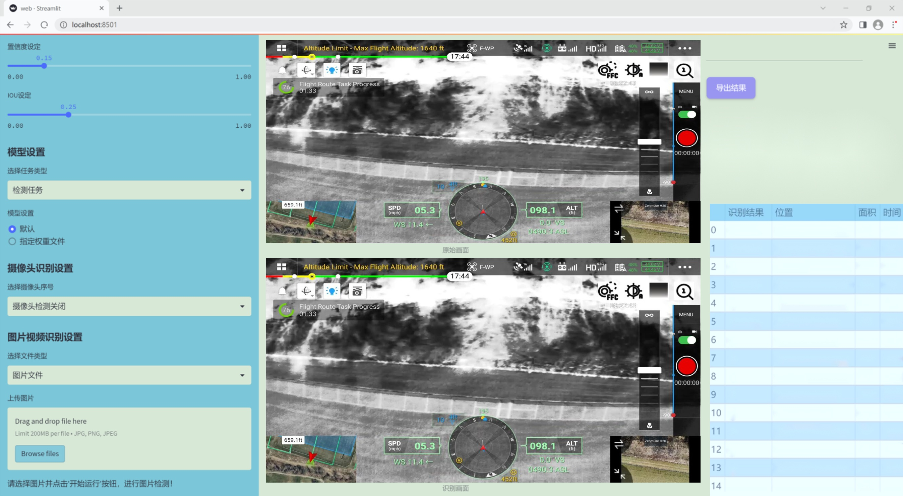
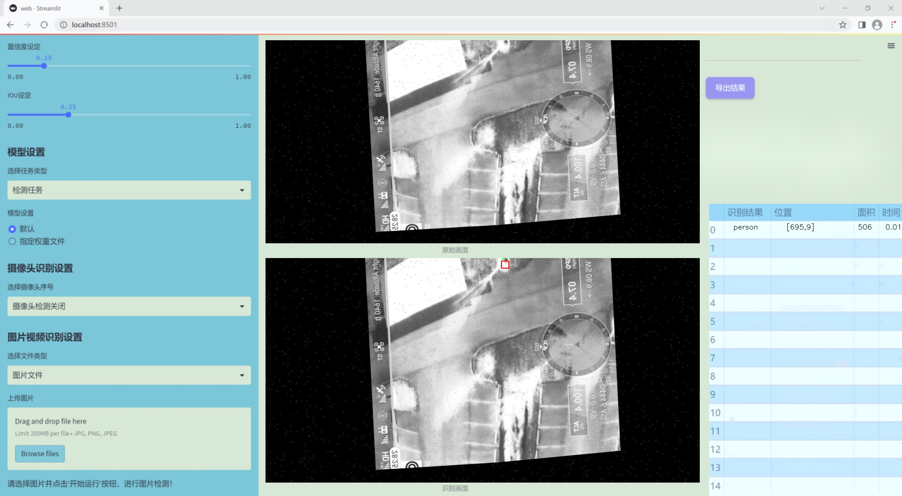
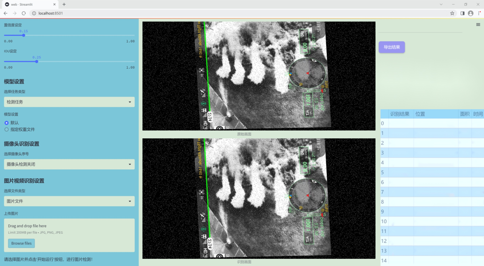
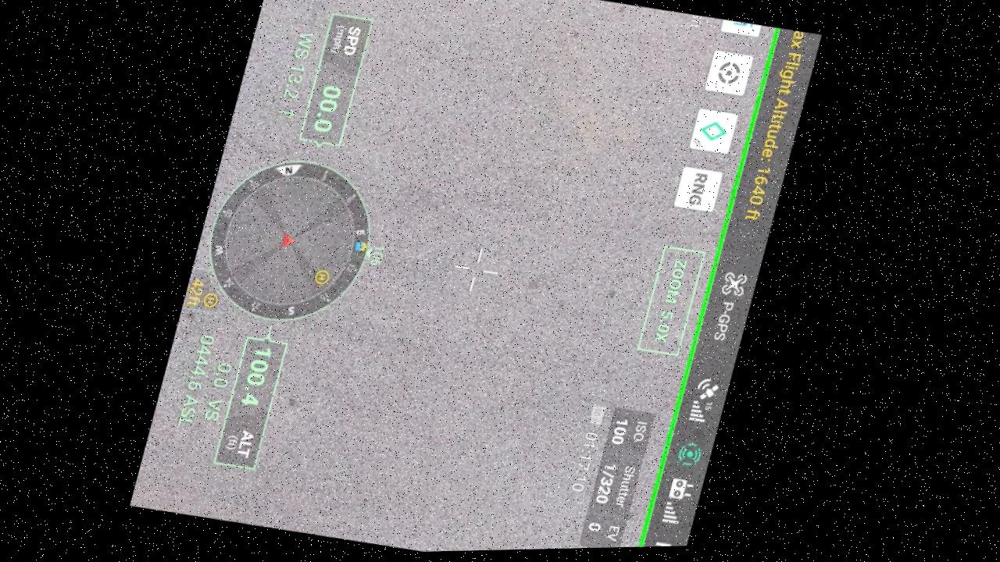
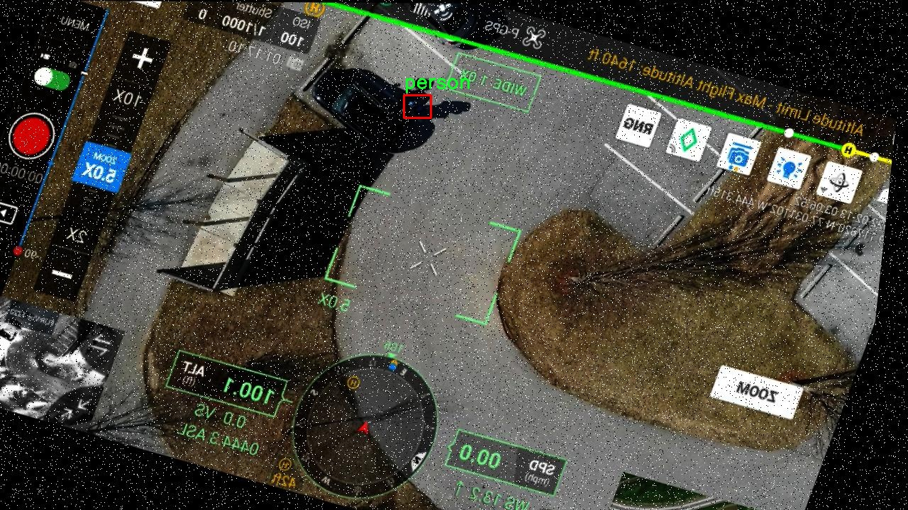
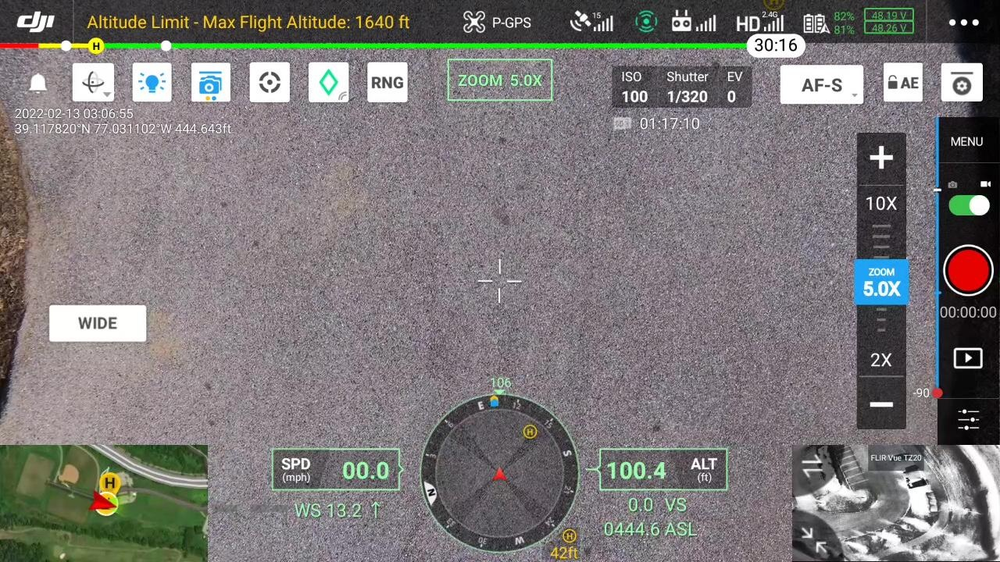
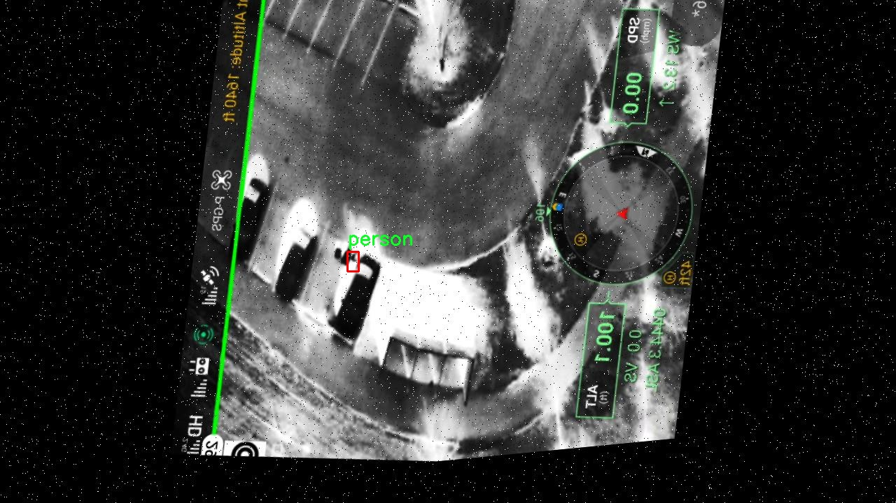
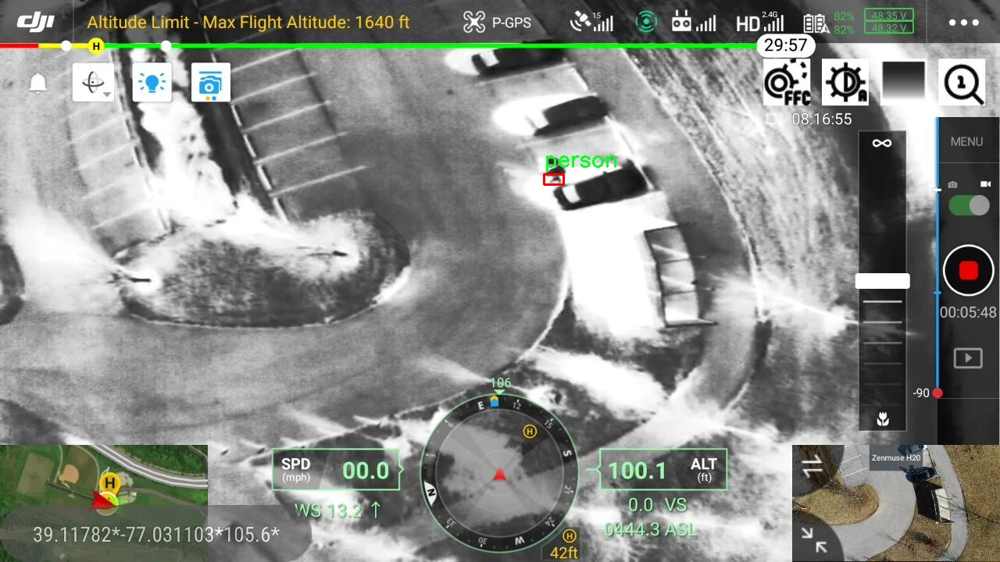

# 改进yolo11-ASF等200+全套创新点大全：大疆无人机热成像人员目标检测系统源码＆数据集全套

### 1.图片效果展示







##### 项目来源 **[人工智能促进会 2024.11.03](https://kdocs.cn/l/cszuIiCKVNis)**

注意：由于项目一直在更新迭代，上面“1.图片效果展示”和“2.视频效果展示”展示的系统图片或者视频可能为老版本，新版本在老版本的基础上升级如下：（实际效果以升级的新版本为准）

  （1）适配了YOLOV11的“目标检测”模型和“实例分割”模型，通过加载相应的权重（.pt）文件即可自适应加载模型。

  （2）支持“图片识别”、“视频识别”、“摄像头实时识别”三种识别模式。

  （3）支持“图片识别”、“视频识别”、“摄像头实时识别”三种识别结果保存导出，解决手动导出（容易卡顿出现爆内存）存在的问题，识别完自动保存结果并导出到tempDir中。

  （4）支持Web前端系统中的标题、背景图等自定义修改。

  另外本项目提供训练的数据集和训练教程,暂不提供权重文件（best.pt）,需要您按照教程进行训练后实现图片演示和Web前端界面演示的效果。

### 2.视频效果展示

[2.1 视频效果展示](https://www.bilibili.com/video/BV1QJDEYzEmP/)

### 3.背景

研究背景与意义

随着无人机技术的迅猛发展，热成像技术在各类应用场景中的重要性日益凸显，尤其是在安全监控、灾害救援和环境监测等领域。大疆无人机作为行业的领先者，其搭载的热成像设备能够在低光照和复杂环境下有效捕捉目标信息，极大地提升了目标检测的效率和准确性。然而，传统的目标检测算法在处理热成像数据时，往往面临着识别精度不足和实时性差的问题。因此，基于改进YOLOv11的热成像人员目标检测系统的研究具有重要的现实意义。

本项目旨在通过对YOLOv11模型的改进，结合大疆无人机的热成像数据，构建一个高效、精准的人员目标检测系统。我们将使用名为“Thermal_Overhead”的数据集，该数据集包含1900幅热成像图像，专注于单一类别的目标检测。这一数据集的构建为模型的训练和测试提供了坚实的基础，能够有效支持算法的优化与验证。

通过对YOLOv11的改进，我们将引入更为先进的特征提取技术和优化策略，以提升模型在热成像图像中的目标检测能力。改进后的系统不仅能够提高检测的准确率，还将显著降低误报率，从而为无人机在复杂环境下的应用提供可靠的技术支持。此外，该系统的成功实施将为相关领域的研究提供重要的参考价值，推动热成像技术与无人机应用的深度融合，进而提升公共安全、环境保护等领域的工作效率和响应速度。

### 4.数据集信息展示

##### 4.1 本项目数据集详细数据（类别数＆类别名）

nc: 1
names: ['person']


该项目为【目标检测】数据集，请在【训练教程和Web端加载模型教程（第三步）】这一步的时候按照【目标检测】部分的教程来训练

##### 4.2 本项目数据集信息介绍

本项目数据集信息介绍

本项目所使用的数据集名为“Thermal_Overhead”，专门为改进YOLOv11的大疆无人机热成像人员目标检测系统而设计。该数据集包含了针对特定目标——人员的热成像图像，旨在提升无人机在复杂环境下的目标检测能力。数据集中仅包含一个类别，即“person”，这使得模型的训练过程更加专注于特定目标的识别与定位。

“Thermal_Overhead”数据集的构建过程经过精心设计，涵盖了多种环境条件下的热成像数据。这些环境包括城市街道、乡村地区以及各种天气条件，如晴天、阴天和雨天等，确保模型在不同场景下的适应性和鲁棒性。数据集中每张图像均经过标注，确保训练过程中模型能够准确学习到目标的特征和热信号。

为了增强数据集的多样性，数据集还包含了不同距离和角度下拍摄的热成像图像。这种多样性不仅有助于提高模型的泛化能力，还能使其在实际应用中更有效地识别和跟踪目标。此外，数据集中的图像均经过预处理，以保证其质量和一致性，从而为模型训练提供一个高质量的基础。

在训练过程中，YOLOv11模型将利用“Thermal_Overhead”数据集中的图像数据进行深度学习，学习如何从热成像信号中提取出与人员相关的特征。通过这种方式，模型将不断优化其检测算法，以实现更高的准确率和更快的检测速度。最终，期望该系统能够在实际应用中有效地识别和定位人员，为无人机在安全监控、救援行动等领域的应用提供强有力的支持。











### 5.全套项目环境部署视频教程（零基础手把手教学）

[5.1 所需软件PyCharm和Anaconda安装教程（第一步）](https://www.bilibili.com/video/BV1BoC1YCEKi/?spm_id_from=333.999.0.0&vd_source=bc9aec86d164b67a7004b996143742dc)


[5.2 安装Python虚拟环境创建和依赖库安装视频教程（第二步）](https://www.bilibili.com/video/BV1ZoC1YCEBw?spm_id_from=333.788.videopod.sections&vd_source=bc9aec86d164b67a7004b996143742dc)

### 6.改进YOLOv11训练教程和Web_UI前端加载模型教程（零基础手把手教学）

[6.1 改进YOLOv11训练教程和Web_UI前端加载模型教程（第三步）](https://www.bilibili.com/video/BV1BoC1YCEhR?spm_id_from=333.788.videopod.sections&vd_source=bc9aec86d164b67a7004b996143742dc)


按照上面的训练视频教程链接加载项目提供的数据集，运行train.py即可开始训练



     Epoch   gpu_mem       box       obj       cls    labels  img_size
     1/200     20.8G   0.01576   0.01955  0.007536        22      1280: 100%|██████████| 849/849 [14:42<00:00,  1.04s/it]
               Class     Images     Labels          P          R     mAP@.5 mAP@.5:.95: 100%|██████████| 213/213 [01:14<00:00,  2.87it/s]
                 all       3395      17314      0.994      0.957      0.0957      0.0843

     Epoch   gpu_mem       box       obj       cls    labels  img_size
     2/200     20.8G   0.01578   0.01923  0.007006        22      1280: 100%|██████████| 849/849 [14:44<00:00,  1.04s/it]
               Class     Images     Labels          P          R     mAP@.5 mAP@.5:.95: 100%|██████████| 213/213 [01:12<00:00,  2.95it/s]
                 all       3395      17314      0.996      0.956      0.0957      0.0845

     Epoch   gpu_mem       box       obj       cls    labels  img_size
     3/200     20.8G   0.01561    0.0191  0.006895        27      1280: 100%|██████████| 849/849 [10:56<00:00,  1.29it/s]
               Class     Images     Labels          P          R     mAP@.5 mAP@.5:.95: 100%|███████   | 187/213 [00:52<00:00,  4.04it/s]
                 all       3395      17314      0.996      0.957      0.0957      0.0845


###### [项目数据集下载链接](https://kdocs.cn/l/cszuIiCKVNis)

### 7.原始YOLOv11算法讲解


ultralytics发布了最新的作品YOLOv11，这一次YOLOv11的变化相对于ultralytics公司的上一代作品YOLOv8变化不是很大的（YOLOv9、YOLOv10均不是ultralytics公司作品），其中改变的位置涉及到C2f变为C3K2，在SPPF后面加了一层类似于注意力机制的C2PSA，还有一个变化大家从yaml文件是看不出来的就是它的检测头内部替换了两个DWConv，以及模型的深度和宽度参数进行了大幅度调整，但是在损失函数方面就没有变化还是采用的CIoU作为边界框回归损失，下面带大家深入理解一下ultralytics最新作品YOLOv11的创新点。

**下图为最近的YOLO系列发布时间线！**


* * *

###### YOLOv11和YOLOv8对比

在YOLOYOLOv5，YOLOv8，和YOLOv11是ultralytics公司作品（ultralytics出品必属精品），下面用一张图片从yaml文件来带大家对比一下YOLOv8和YOLOv11的区别，配置文件变得内容比较少大家可以看一卡，左侧为YOLOv8右侧为YOLOv11，不同的点我用黑线标注了出来。


* * *

###### YOLOv11的网络结构解析

下面的图片为YOLOv11的网络结构图。


**其中主要创新点可以总结如下- > **

* * *

1\.
提出C3k2机制，其中C3k2有参数为c3k，其中在网络的浅层c3k设置为False（下图中可以看到c3k2第二个参数被设置为False，就是对应的c3k参数）。


此时所谓的C3k2就相当于YOLOv8中的C2f，其网络结构为一致的，其中的C3k机制的网络结构图如下图所示
**（为什么叫C3k2，我个人理解是因为C3k的调用时C3k其中的参数N固定设置为2的原因，个人理解不一定对** ）。


* * *

2\.
第二个创新点是提出C2PSA机制，这是一个C2（C2f的前身）机制内部嵌入了一个多头注意力机制，在这个过程中我还发现作者尝试了C2fPSA机制但是估计效果不如C2PSA，有的时候机制有没有效果理论上真的很难解释通，下图为C2PSA机制的原理图，仔细观察把Attention哪里去掉则C2PSA机制就变为了C2所以我上面说C2PSA就是C2里面嵌入了一个PSA机制。


* * *

3\.
第三个创新点可以说是原先的解耦头中的分类检测头增加了两个DWConv，具体的对比大家可以看下面两个图下面的是YOLOv11的解耦头，上面的是YOLOv8的解耦头.


我们上面看到了在分类检测头中YOLOv11插入了两个DWConv这样的做法可以大幅度减少参数量和计算量（原先两个普通的Conv大家要注意到卷积和是由3变为了1的，这是形成了两个深度可分离Conv），大家可能不太理解为什么加入了两个DWConv还能够减少计算量，以及什么是深度可分离Conv，下面我来解释一下。

> **`DWConv` 代表 Depthwise
> Convolution（深度卷积）**，是一种在卷积神经网络中常用的高效卷积操作。它主要用于减少计算复杂度和参数量，尤其在移动端或轻量化网络（如
> MobileNet）中十分常见。
>
> **1\. 标准卷积的计算过程**
>
> 在标准卷积操作中，对于一个输入张量（通常是一个多通道的特征图），卷积核的尺寸是 `(h, w, C_in)`，其中 `h` 和 `w`
> 是卷积核的空间尺寸，`C_in`
> 是输入通道的数量。而卷积核与输入张量做的是完整的卷积运算，每个输出通道都与所有输入通道相连并参与卷积操作，导致计算量比较大。
>
> 标准卷积的计算过程是这样的：
>
>   * 每个输出通道是所有输入通道的组合（加权求和），卷积核在每个位置都会计算与所有输入通道的点积。
>   * 假设有 `C_in` 个输入通道和 `C_out` 个输出通道，那么卷积核的总参数量是 `C_in * C_out * h * w`。
>

>
> 2\. **Depthwise Convolution（DWConv）**
>
> 与标准卷积不同， **深度卷积** 将输入的每个通道单独处理，即 **每个通道都有自己的卷积核进行卷积**
> ，不与其他通道进行交互。它可以被看作是标准卷积的一部分，专注于空间维度上的卷积运算。
>
> **深度卷积的计算过程：**
>
>   * 假设输入张量有 `C_in` 个通道，每个通道会使用一个 `h × w`
> 的卷积核进行卷积操作。这个过程称为“深度卷积”，因为每个通道独立进行卷积运算。
>   * 输出的通道数与输入通道数一致，每个输出通道只和对应的输入通道进行卷积，没有跨通道的组合。
>   * 参数量和计算量相比标准卷积大大减少，卷积核的参数量是 `C_in * h * w`。
>

>
> **深度卷积的优点：**
>
>   1. **计算效率高** ：相对于标准卷积，深度卷积显著减少了计算量。它只处理空间维度上的卷积，不再处理通道间的卷积。
>   2.  **参数量减少** ：由于每个卷积核只对单个通道进行卷积，参数量大幅减少。例如，标准卷积的参数量为 `C_in * C_out * h *
> w`，而深度卷积的参数量为 `C_in * h * w`。
>   3.  **结合点卷积可提升效果** ：为了弥补深度卷积缺乏跨通道信息整合的问题，通常深度卷积后会配合 `1x1` 的点卷积（Pointwise
> Convolution）使用，通过 `1x1` 的卷积核整合跨通道的信息。这种组合被称为 **深度可分离卷积** （Depthwise
> Separable Convolution） | **这也是我们本文YOLOv11中的做法** 。
>

>
> 3\. **深度卷积与标准卷积的区别**
>
> 操作类型| 卷积核大小| 输入通道数| 输出通道数| 参数量  
> ---|---|---|---|---  
> 标准卷积| `h × w`| `C_in`| `C_out`| `C_in * C_out * h * w`  
> 深度卷积（DWConv）| `h × w`| `C_in`| `C_in`| `C_in * h * w`  
>  
> 可以看出，深度卷积在相同的卷积核大小下，参数量减少了约 `C_out` 倍
> （细心的人可以发现用最新版本的ultralytics仓库运行YOLOv8参数量相比于之前的YOLOv8以及大幅度减少了这就是因为检测头改了的原因但是名字还是Detect，所以如果你想继续用YOLOv8发表论文做实验那么不要更新最近的ultralytics仓库）。
>
> **4\. 深度可分离卷积 (Depthwise Separable Convolution)**
>
> 深度卷积常与 `1x1` 的点卷积配合使用，这称为深度可分离卷积。其过程如下：
>
>   1. 先对输入张量进行深度卷积，对每个通道独立进行空间卷积。
>   2. 然后通过 `1x1` 点卷积，对通道维度进行混合，整合不同通道的信息。
>

>
> 这样既可以保证计算量的减少，又可以保持跨通道的信息流动。
>
> 5\. **总结**
>
> `DWConv` 是一种高效的卷积方式，通过单独处理每个通道来减少计算量，结合 `1x1`
> 的点卷积，形成深度可分离卷积，可以在保持网络性能的同时极大地减少模型的计算复杂度和参数量。

**看到这里大家应该明白了为什么加入了两个DWConv还能减少参数量以及YOLOv11的检测头创新点在哪里。**

* * *

##### YOLOv11和YOLOv8还有一个不同的点就是其各个版本的模型（N - S - M- L - X）网络深度和宽度变了


可以看到在深度（depth）和宽度
（width）两个地方YOLOv8和YOLOv11是基本上完全不同了，这里我理解这么做的含义就是模型网络变小了，所以需要加深一些模型的放缩倍数来弥补模型之前丧失的能力从而来达到一个平衡。

> **本章总结：**
> YOLOv11的改进点其实并不多更多的都是一些小的结构上的创新，相对于之前的YOLOv5到YOLOv8的创新，其实YOLOv11的创新点不算多，但是其是ultralytics公司的出品，同时ultralytics仓库的使用量是非常多的（不像YOLOv9和YOLOv10）所以在未来的很长一段时间内其实YOLO系列估计不会再更新了，YOLOv11作为最新的SOTA肯定是十分适合大家来发表论文和创新的。
>

### 8.200+种全套改进YOLOV11创新点原理讲解

#### 8.1 200+种全套改进YOLOV11创新点原理讲解大全

由于篇幅限制，每个创新点的具体原理讲解就不全部展开，具体见下列网址中的改进模块对应项目的技术原理博客网址【Blog】（创新点均为模块化搭建，原理适配YOLOv5~YOLOv11等各种版本）

[改进模块技术原理博客【Blog】网址链接](https://gitee.com/qunmasj/good)


#### 8.2 精选部分改进YOLOV11创新点原理讲解

###### 这里节选部分改进创新点展开原理讲解(完整的改进原理见上图和[改进模块技术原理博客链接](https://gitee.com/qunmasj/good)【如果此小节的图加载失败可以通过CSDN或者Github搜索该博客的标题访问原始博客，原始博客图片显示正常】


### FocalModulation模型的基本原理
参考该博客，Focal Modulation Networks（FocalNets）的基本原理是替换自注意力（Self-Attention）模块，使用焦点调制（focal modulation）机制来捕捉图像中的长距离依赖和上下文信息。下图是自注意力和焦点调制两种方法的对比。


自注意力要求对每个查询令牌（Query Token）与其他令牌进行复杂的查询-键（Query-Key）交互和查询-值（Query-Value）聚合，以计算注意力分数并捕捉上下文。而焦点调制则先将空间上下文以不同粒度聚合到调制器中，然后以查询依赖的方式将这些调制器注入到查询令牌中。焦点调制简化了交互和聚合操作，使其更轻量级。在图中，自注意力部分使用红色虚线表示查询-键交互和黄色虚线表示查询-值聚合，而焦点调制部分则用蓝色表示调制器聚合和黄色表示查询-调制器交互。 

FocalModulation模型通过以下步骤实现：

1. 焦点上下文化：用深度卷积层堆叠来编码不同范围的视觉上下文。


2. 门控聚合：通过门控机制，选择性地将上下文信息聚合到每个查询令牌的调制器中。


3. 逐元素仿射变换：将聚合后的调制器通过仿射变换注入到每个查询令牌中。

下面来分别介绍这三个机制->

#### 焦点上下文化
焦点上下文化（Focal Contextualization）是焦点调制（Focal Modulation）的一个组成部分。焦点上下文化使用一系列深度卷积层（depth-wise convolutional layers）来编码不同范围内的视觉上下文信息。这些层可以捕捉从近处到远处的视觉特征，从而允许网络在不同层次上理解图像内容。通过这种方式，网络能够在聚合上下文信息时保持对局部细节的敏感性，并增强对全局结构的认识。


​

这张图详细比较了自注意力（Self-Attention, SA）和焦点调制（Focal Modulation）的机制，并特别展示了焦点调制中的上下文聚合过程。左侧的图展示了自注意力模型如何通过键（k）和查询（q）之间的交互，以及随后的聚合来生成输出。而中间和右侧的图说明了焦点调制如何通过层级化的上下文聚合和门控聚合过程替代自注意力模型的这一过程。在焦点调制中，输入首先通过轻量级线性层进行处理，然后通过层级化的上下文化模块和门控机制来选择性地聚合信息，最终通过调制器与查询（q）进行交互以生成输出。

#### 门控聚合
在Focal Modulation Networks（FocalNets）中的 "门控聚合"（Gated Aggregation）是关键组件之一，这一过程涉及使用门控机制来选择性地聚合上下文信息。以下是这个过程的详细分析：

1. 什么是门控机制？
门控机制在深度学习中常用于控制信息流。它通常用于决定哪些信息应该被传递，哪些应该被阻断。在循环神经网络（RNN）中，特别是在长短期记忆网络（LSTM）和门控循环单元（GRU）中，门控机制用于调节信息在时间序列数据中的流动。

2. 门控聚合的目的
在FocalNets中，门控聚合的目的是为每个查询令牌（即处理中的数据单元）选择性地聚合上下文信息。这意味着网络能够决定哪些特定的上下文信息对于当前处理的查询令牌是重要的，从而专注于那些最相关的信息。

3. 如何实现门控聚合？
实现门控聚合可能涉及一系列计算步骤，其中包括：

计算上下文信息：这可能涉及使用深度卷积层（如文中提到的）对输入图像的不同区域进行编码，以捕捉从局部到全局的视觉上下文。
门控操作：这一步骤涉及到一个决策过程，根据当前查询令牌的特征来决定哪些上下文信息是相关的。这可能通过一个学习到的权重（门）来实现，该权重决定了不同上下文信息的重要性。
信息聚合：最后，根据门控操作的结果，选择性地聚合上下文信息到一个调制器中。这个调制器随后被用于调整或“调制”查询令牌的表示。
4. 门控聚合的好处
通过门控聚合，FocalNets能够更有效地聚焦于对当前任务最关键的信息。这种方法提高了模型的效率和性能，因为它减少了不必要信息的处理，同时增强了对关键特征的关注。在视觉任务中，这可能意味着更好的目标检测和图像分类性能，特别是在复杂或多变的视觉环境中。

总结：门控聚合是FocalNets的一个核心组成部分，它通过选择性地集中处理重要的上下文信息来提升网络的效率和性能。

#### 逐元素仿射变换
在Focal Modulation Networks（FocalNets）中的第三个关键组件是逐元素仿射变换，这个步骤涉及将通过门控聚合得到的调制器注入到每个查询令牌中。以下是该过程的详细分析：

1. 仿射变换的基本概念：
仿射变换是一种线性变换，用于对数据进行缩放、旋转、平移和倾斜等操作。在深度学习中，逐元素的仿射变换通常指的是对每个元素进行线性变换，这种变换可以被描述为y = ax + b，其中x是输入，y是输出，a和b是变换的参数。

2. 逐元素仿射变换的作用：
在FocalNets中，逐元素仿射变换的作用是将聚合后的调制器信息注入到每个查询令牌中。这个步骤对于整合上下文信息和查询令牌的原始特征非常重要。通过这种方式，调制器所包含的上下文信息可以直接影响查询令牌的表示。

3. 执行仿射变换：
执行这一步骤时，聚合后的调制器对每个查询令牌进行逐元素的仿射变换。在实践中，这可能意味着对查询令牌的每个特征应用调制器中的相应权重（a）和偏差（b）。这样，调制器中的每个元素都直接对应于查询令牌的一个特征，通过调整这些特征来改变其表达。

4. 仿射变换的效果：
通过逐元素仿射变换，模型能够更细致地调整每个查询令牌的特征，根据上下文信息来增强或抑制某些特征。这种精细的调整机制允许网络更好地适应复杂的视觉场景，提高对细节的捕捉能力，从而提升了模型在各种视觉任务中的性能，如目标检测和图像分类。

总结：逐元素仿射变换它使得模型能够利用上下文信息来有效地调整查询令牌，增强了模型对关键视觉特征的捕捉和表达能力。


### 9.系统功能展示

图9.1.系统支持检测结果表格显示

  图9.2.系统支持置信度和IOU阈值手动调节

  图9.3.系统支持自定义加载权重文件best.pt(需要你通过步骤5中训练获得)

  图9.4.系统支持摄像头实时识别

  图9.5.系统支持图片识别

  图9.6.系统支持视频识别

  图9.7.系统支持识别结果文件自动保存

  图9.8.系统支持Excel导出检测结果数据


### 10. YOLOv11核心改进源码讲解

#### 10.1 convnextv2.py

以下是对给定代码的核心部分进行分析和详细注释的结果：

```python
import torch
import torch.nn as nn
import torch.nn.functional as F

class LayerNorm(nn.Module):
    """ 自定义的LayerNorm层，支持两种数据格式：channels_last（默认）和channels_first。
    channels_last对应的输入形状为(batch_size, height, width, channels)，
    而channels_first对应的输入形状为(batch_size, channels, height, width)。
    """
    def __init__(self, normalized_shape, eps=1e-6, data_format="channels_last"):
        super().__init__()
        self.weight = nn.Parameter(torch.ones(normalized_shape))  # 权重参数
        self.bias = nn.Parameter(torch.zeros(normalized_shape))    # 偏置参数
        self.eps = eps  # 防止除零的极小值
        self.data_format = data_format  # 数据格式
        if self.data_format not in ["channels_last", "channels_first"]:
            raise NotImplementedError 
        self.normalized_shape = (normalized_shape, )
    
    def forward(self, x):
        """ 前向传播函数，根据数据格式进行归一化处理 """
        if self.data_format == "channels_last":
            return F.layer_norm(x, self.normalized_shape, self.weight, self.bias, self.eps)
        elif self.data_format == "channels_first":
            u = x.mean(1, keepdim=True)  # 计算均值
            s = (x - u).pow(2).mean(1, keepdim=True)  # 计算方差
            x = (x - u) / torch.sqrt(s + self.eps)  # 归一化
            x = self.weight[:, None, None] * x + self.bias[:, None, None]  # 应用权重和偏置
            return x

class Block(nn.Module):
    """ ConvNeXtV2的基本块，包含深度可分离卷积、归一化、激活函数等 """
    def __init__(self, dim, drop_path=0.):
        super().__init__()
        self.dwconv = nn.Conv2d(dim, dim, kernel_size=7, padding=3, groups=dim)  # 深度卷积
        self.norm = LayerNorm(dim, eps=1e-6)  # 归一化层
        self.pwconv1 = nn.Linear(dim, 4 * dim)  # 1x1卷积（点卷积）
        self.act = nn.GELU()  # 激活函数
        self.pwconv2 = nn.Linear(4 * dim, dim)  # 1x1卷积（点卷积）
        self.drop_path = nn.Identity() if drop_path <= 0. else DropPath(drop_path)  # 随机深度

    def forward(self, x):
        """ 前向传播函数 """
        input = x  # 保存输入以便后续残差连接
        x = self.dwconv(x)  # 深度卷积
        x = self.norm(x.permute(0, 2, 3, 1))  # 归一化
        x = self.pwconv1(x)  # 点卷积
        x = self.act(x)  # 激活
        x = self.pwconv2(x)  # 反向点卷积
        x = x.permute(0, 3, 1, 2)  # 恢复原始形状
        x = input + self.drop_path(x)  # 残差连接
        return x

class ConvNeXtV2(nn.Module):
    """ ConvNeXt V2模型 """
    def __init__(self, in_chans=3, num_classes=1000, 
                 depths=[3, 3, 9, 3], dims=[96, 192, 384, 768], 
                 drop_path_rate=0., head_init_scale=1.):
        super().__init__()
        self.downsample_layers = nn.ModuleList()  # 下采样层
        # Stem层
        stem = nn.Sequential(
            nn.Conv2d(in_chans, dims[0], kernel_size=4, stride=4),
            LayerNorm(dims[0], eps=1e-6, data_format="channels_first")
        )
        self.downsample_layers.append(stem)
        # 添加下采样层
        for i in range(3):
            downsample_layer = nn.Sequential(
                LayerNorm(dims[i], eps=1e-6, data_format="channels_first"),
                nn.Conv2d(dims[i], dims[i+1], kernel_size=2, stride=2),
            )
            self.downsample_layers.append(downsample_layer)

        self.stages = nn.ModuleList()  # 特征分辨率阶段
        dp_rates = [x.item() for x in torch.linspace(0, drop_path_rate, sum(depths))] 
        cur = 0
        for i in range(4):
            stage = nn.Sequential(
                *[Block(dim=dims[i], drop_path=dp_rates[cur + j]) for j in range(depths[i])]
            )
            self.stages.append(stage)
            cur += depths[i]

        self.norm = nn.LayerNorm(dims[-1], eps=1e-6)  # 最终归一化层
        self.head = nn.Linear(dims[-1], num_classes)  # 分类头

    def forward(self, x):
        """ 前向传播函数 """
        res = []
        for i in range(4):
            x = self.downsample_layers[i](x)  # 下采样
            x = self.stages[i](x)  # 特征提取
            res.append(x)  # 保存每个阶段的输出
        return res

def convnextv2_tiny(weights='', **kwargs):
    """ 创建ConvNeXtV2 Tiny模型并加载权重 """
    model = ConvNeXtV2(depths=[3, 3, 9, 3], dims=[96, 192, 384, 768], **kwargs)
    if weights:
        model.load_state_dict(torch.load(weights)['model'])  # 加载权重
    return model
```

### 代码分析与注释总结
1. **LayerNorm**: 自定义的层归一化实现，支持两种数据格式，适用于不同的输入形状。
2. **Block**: ConvNeXtV2的基本构建块，包含深度卷积、归一化、激活和残差连接。
3. **ConvNeXtV2**: 主模型类，包含多个下采样层和特征提取阶段，构建了整个网络的结构。
4. **convnextv2_tiny**: 用于创建特定配置的ConvNeXtV2模型并加载预训练权重的函数。

通过以上分析，可以看出这些核心部分构成了ConvNeXtV2模型的基础，提供了深度学习中的常用模块和功能。

这个文件定义了一个名为 `ConvNeXtV2` 的深度学习模型，主要用于图像分类任务。该模型是基于卷积神经网络（CNN）的架构，结合了一些新的设计理念，以提高性能和效率。

首先，文件中导入了必要的库，包括 PyTorch 和一些辅助函数。接着，定义了几个重要的类。`LayerNorm` 类实现了层归一化，支持两种数据格式：`channels_last` 和 `channels_first`。这使得模型可以灵活处理不同格式的输入数据。`GRN` 类实现了全局响应归一化（Global Response Normalization），通过计算输入的 L2 范数来进行归一化，增强了模型的表达能力。

`Block` 类是 ConvNeXtV2 的基本构建块，包含了深度可分离卷积、层归一化、点卷积、激活函数（GELU）和 GRN。这个模块的设计使得信息能够在不同层之间有效传递，并且通过随机深度（Drop Path）技术增加了模型的鲁棒性。

`ConvNeXtV2` 类是整个模型的核心，构造函数中定义了输入通道数、分类头的类别数、每个阶段的块数、特征维度等参数。模型的前端包括一个初始卷积层和多个下采样层，后面是多个特征分辨率阶段，每个阶段由多个 `Block` 组成。最后，模型还包括一个层归一化和一个线性分类头。

模型的权重初始化通过 `_init_weights` 方法完成，使用了截断正态分布进行卷积和线性层的权重初始化。`forward` 方法定义了模型的前向传播过程，逐层处理输入数据，并在每个阶段保存输出结果。

文件的最后部分定义了一些函数，用于创建不同规模的 ConvNeXtV2 模型（如 atto、femto、pico 等），这些函数允许用户加载预训练的权重，以便在特定任务上进行微调。

整体来看，这个文件实现了一个灵活且高效的卷积神经网络架构，结合了现代深度学习中的一些先进技术，适用于图像分类等任务。

#### 10.2 RFAConv.py

以下是代码中最核心的部分，并附上详细的中文注释：

```python
import torch
import torch.nn as nn
from einops import rearrange

class RFAConv(nn.Module):
    def __init__(self, in_channel, out_channel, kernel_size, stride=1):
        super().__init__()
        self.kernel_size = kernel_size

        # 用于获取权重的卷积模块
        self.get_weight = nn.Sequential(
            nn.AvgPool2d(kernel_size=kernel_size, padding=kernel_size // 2, stride=stride),
            nn.Conv2d(in_channel, in_channel * (kernel_size ** 2), kernel_size=1, groups=in_channel, bias=False)
        )
        
        # 用于生成特征的卷积模块
        self.generate_feature = nn.Sequential(
            nn.Conv2d(in_channel, in_channel * (kernel_size ** 2), kernel_size=kernel_size, padding=kernel_size // 2, stride=stride, groups=in_channel, bias=False),
            nn.BatchNorm2d(in_channel * (kernel_size ** 2)),
            nn.ReLU()
        )
        
        # 最终的卷积操作
        self.conv = nn.Conv2d(in_channel, out_channel, kernel_size=kernel_size, stride=kernel_size)

    def forward(self, x):
        b, c = x.shape[0:2]  # 获取输入的批次大小和通道数
        weight = self.get_weight(x)  # 获取权重
        h, w = weight.shape[2:]  # 获取特征图的高和宽
        
        # 对权重进行softmax处理
        weighted = weight.view(b, c, self.kernel_size ** 2, h, w).softmax(2)  # b c*kernel**2, h, w
        
        # 生成特征
        feature = self.generate_feature(x).view(b, c, self.kernel_size ** 2, h, w)  # b c*kernel**2, h, w
        
        # 加权特征
        weighted_data = feature * weighted
        
        # 重新排列特征数据
        conv_data = rearrange(weighted_data, 'b c (n1 n2) h w -> b c (h n1) (w n2)', n1=self.kernel_size, n2=self.kernel_size)
        
        return self.conv(conv_data)  # 返回卷积结果


class SE(nn.Module):
    def __init__(self, in_channel, ratio=16):
        super(SE, self).__init__()
        self.gap = nn.AdaptiveAvgPool2d((1, 1))  # 全局平均池化
        self.fc = nn.Sequential(
            nn.Linear(in_channel, ratio, bias=False),  # 从 c -> c/r
            nn.ReLU(),
            nn.Linear(ratio, in_channel, bias=False),  # 从 c/r -> c
            nn.Sigmoid()
        )

    def forward(self, x):
        b, c = x.shape[0:2]  # 获取输入的批次大小和通道数
        y = self.gap(x).view(b, c)  # 进行全局平均池化并调整形状
        y = self.fc(y).view(b, c, 1, 1)  # 通过全连接层并调整形状
        return y  # 返回通道注意力权重


class RFCBAMConv(nn.Module):
    def __init__(self, in_channel, out_channel, kernel_size=3, stride=1):
        super().__init__()
        assert kernel_size % 2 == 1, "the kernel_size must be odd."  # 确保卷积核大小为奇数
        self.kernel_size = kernel_size
        
        # 特征生成模块
        self.generate = nn.Sequential(
            nn.Conv2d(in_channel, in_channel * (kernel_size ** 2), kernel_size, padding=kernel_size // 2, stride=stride, groups=in_channel, bias=False),
            nn.BatchNorm2d(in_channel * (kernel_size ** 2)),
            nn.ReLU()
        )
        
        # 权重获取模块
        self.get_weight = nn.Sequential(nn.Conv2d(2, 1, kernel_size=3, padding=1, bias=False), nn.Sigmoid())
        self.se = SE(in_channel)  # 通道注意力模块

        self.conv = nn.Conv2d(in_channel, out_channel, kernel_size=kernel_size, stride=kernel_size)

    def forward(self, x):
        b, c = x.shape[0:2]  # 获取输入的批次大小和通道数
        channel_attention = self.se(x)  # 获取通道注意力
        generate_feature = self.generate(x)  # 生成特征

        h, w = generate_feature.shape[2:]  # 获取特征图的高和宽
        generate_feature = generate_feature.view(b, c, self.kernel_size ** 2, h, w)  # 调整形状
        
        # 重新排列特征数据
        generate_feature = rearrange(generate_feature, 'b c (n1 n2) h w -> b c (h n1) (w n2)', n1=self.kernel_size, n2=self.kernel_size)
        
        # 加权特征
        unfold_feature = generate_feature * channel_attention
        
        # 计算最大和平均特征
        max_feature, _ = torch.max(generate_feature, dim=1, keepdim=True)
        mean_feature = torch.mean(generate_feature, dim=1, keepdim=True)
        
        # 获取感受野注意力
        receptive_field_attention = self.get_weight(torch.cat((max_feature, mean_feature), dim=1))
        
        # 返回卷积结果
        conv_data = unfold_feature * receptive_field_attention
        return self.conv(conv_data)
```

### 代码说明：
1. **RFAConv**: 该类实现了一种基于卷积的特征加权机制。通过平均池化和卷积生成权重，并利用这些权重对特征进行加权处理，最后通过卷积层输出结果。
   
2. **SE (Squeeze-and-Excitation)**: 该类实现了通道注意力机制，通过全局平均池化和全连接层来生成通道权重，从而增强重要特征的表达。

3. **RFCBAMConv**: 该类结合了特征生成和通道注意力机制，进一步通过最大池化和平均池化来计算感受野注意力，并对生成的特征进行加权，最后通过卷积层输出结果。

以上代码展示了如何通过不同的模块和机制来增强卷积神经网络的特征提取能力。

这个程序文件 `RFAConv.py` 定义了一些基于卷积神经网络的模块，主要包括 RFAConv、RFCBAMConv 和 RFCAConv。这些模块使用了不同的卷积和注意力机制，以增强特征提取的能力。

首先，文件中导入了必要的库，包括 PyTorch 和 einops。接着，定义了两个激活函数类：`h_sigmoid` 和 `h_swish`。`h_sigmoid` 是一种带有 ReLU6 的激活函数，而 `h_swish` 则是将输入乘以 `h_sigmoid` 的结果。

`RFAConv` 类是一个自定义的卷积模块，包含了一个生成特征的卷积层和一个加权卷积层。其构造函数中定义了获取权重的操作，通过平均池化和卷积来实现。前向传播中，首先计算输入特征的权重，然后生成特征，接着将加权后的特征进行重排，最后通过卷积层输出结果。

`SE` 类实现了 Squeeze-and-Excitation（SE）机制，通过全局平均池化和全连接层来计算通道注意力。前向传播中，首先对输入进行全局平均池化，然后通过全连接层得到通道权重。

`RFCBAMConv` 类结合了 SE 机制和 RFAConv 的特性。它在构造函数中定义了生成特征的卷积层和用于计算通道注意力的 SE 模块。在前向传播中，首先计算通道注意力，然后生成特征，接着计算最大值和均值特征，利用这些特征计算接收场注意力，最后将结果通过卷积层输出。

`RFCAConv` 类是一个更复杂的模块，结合了 RFAConv 和通道注意力机制。它在构造函数中定义了生成特征的卷积层，并通过自适应平均池化计算特征的高度和宽度信息。在前向传播中，生成特征后，分别对高度和宽度进行池化，接着通过全连接层计算通道注意力，并将生成的特征与注意力相乘，最后通过卷积层输出结果。

总体来说，这个文件实现了一些先进的卷积模块，利用不同的特征生成和注意力机制来提高网络的性能，适用于图像处理和计算机视觉任务。

#### 10.3 SMPConv.py

以下是代码中最核心的部分，并附上详细的中文注释：

```python
import torch
import torch.nn as nn
import torch.nn.functional as F

# 定义一个相对位置的函数，用于生成卷积核的坐标
def rel_pos(kernel_size):
    # 生成从-1到1的线性空间，作为卷积核的坐标
    tensors = [torch.linspace(-1, 1, steps=kernel_size) for _ in range(2)]
    kernel_coord = torch.stack(torch.meshgrid(*tensors), dim=-0)  # 生成网格坐标
    kernel_coord = kernel_coord.unsqueeze(0)  # 增加一个维度
    return kernel_coord

# 定义自定义卷积层
class SMPConv(nn.Module):
    def __init__(self, planes, kernel_size, n_points, stride, padding, groups):
        super().__init__()

        self.planes = planes  # 输出通道数
        self.kernel_size = kernel_size  # 卷积核大小
        self.n_points = n_points  # 卷积核中的点数
        self.init_radius = 2 * (2/kernel_size)  # 初始化半径

        # 生成卷积核坐标
        kernel_coord = rel_pos(kernel_size)
        self.register_buffer('kernel_coord', kernel_coord)  # 注册为buffer，不会被优化

        # 初始化权重坐标
        weight_coord = torch.empty(1, n_points, 2)
        nn.init.trunc_normal_(weight_coord, std=0.2, a=-1., b=1.)  # 截断正态分布初始化
        self.weight_coord = nn.Parameter(weight_coord)  # 权重坐标为可学习参数

        # 初始化半径
        self.radius = nn.Parameter(torch.empty(1, n_points).unsqueeze(-1).unsqueeze(-1))
        self.radius.data.fill_(value=self.init_radius)  # 填充初始值

        # 初始化卷积权重
        weights = torch.empty(1, planes, n_points)
        nn.init.trunc_normal_(weights, std=.02)  # 权重初始化
        self.weights = nn.Parameter(weights)  # 权重为可学习参数

    def forward(self, x):
        # 生成卷积核并进行卷积操作
        kernels = self.make_kernels().unsqueeze(1)  # 生成卷积核
        x = x.contiguous()  # 确保输入是连续的
        kernels = kernels.contiguous()  # 确保卷积核是连续的

        # 根据输入数据类型选择合适的卷积实现
        if x.dtype == torch.float32:
            x = _DepthWiseConv2dImplicitGEMMFP32.apply(x, kernels)  # FP32卷积
        elif x.dtype == torch.float16:
            x = _DepthWiseConv2dImplicitGEMMFP16.apply(x, kernels)  # FP16卷积
        else:
            raise TypeError("Only support fp32 and fp16, get {}".format(x.dtype))  # 抛出异常
        return x        

    def make_kernels(self):
        # 计算卷积核
        diff = self.weight_coord.unsqueeze(-2) - self.kernel_coord.reshape(1, 2, -1).transpose(1, 2)  # 计算差值
        diff = diff.transpose(2, 3).reshape(1, self.n_points, 2, self.kernel_size, self.kernel_size)  # 变形
        diff = F.relu(1 - torch.sum(torch.abs(diff), dim=2) / self.radius)  # 计算ReLU激活后的差值
        
        # 计算最终的卷积核
        kernels = torch.matmul(self.weights, diff.reshape(1, self.n_points, -1))  # 加权求和
        kernels = kernels.reshape(1, self.planes, *self.kernel_coord.shape[2:])  # 变形为卷积核形状
        kernels = kernels.squeeze(0)  # 去掉多余的维度
        kernels = torch.flip(kernels.permute(0, 2, 1), dims=(1,))  # 反转维度
        return kernels

# 定义SMPBlock模块
class SMPBlock(nn.Module):
    def __init__(self, in_channels, dw_channels, lk_size, drop_path, n_points=None, n_points_divide=4):
        super().__init__()
        # 定义逐点卷积和SMP卷积
        self.pw1 = conv_bn_relu(in_channels, dw_channels, 1, 1, 0, groups=1)
        self.pw2 = conv_bn(dw_channels, in_channels, 1, 1, 0, groups=1)
        self.large_kernel = SMPCNN(in_channels=dw_channels, out_channels=dw_channels, kernel_size=lk_size,
                                   stride=1, groups=dw_channels, n_points=n_points, n_points_divide=n_points_divide)
        self.lk_nonlinear = nn.ReLU()  # 激活函数
        self.drop_path = DropPath(drop_path) if drop_path > 0. else nn.Identity()  # DropPath

    def forward(self, x):
        # 前向传播
        out = self.pw1(x)  # 逐点卷积
        out = self.large_kernel(out)  # 大卷积
        out = self.lk_nonlinear(out)  # 激活
        out = self.pw2(out)  # 逐点卷积
        return x + self.drop_path(out)  # 残差连接
```

### 代码核心部分解释：
1. **SMPConv**：自定义卷积层，使用相对位置的卷积核。通过生成卷积核坐标和权重坐标来计算卷积操作。
2. **make_kernels**：生成卷积核的核心函数，计算卷积核的差值并进行加权求和。
3. **SMPBlock**：构建一个包含逐点卷积和SMP卷积的模块，使用残差连接和DropPath技术。

这个程序文件 `SMPConv.py` 定义了一些用于深度学习的卷积神经网络模块，主要是基于 PyTorch 框架实现的。文件中包含了多个类和函数，主要包括 `SMPConv`、`SMPCNN`、`SMPCNN_ConvFFN` 和 `SMPBlock`，这些模块结合了传统卷积和一些新的卷积策略，以提高模型的表现。

首先，文件导入了必要的库，包括 PyTorch 的核心模块、神经网络模块和一些实用功能。接着，定义了一个辅助函数 `rel_pos`，用于生成相对位置的坐标，这在卷积操作中可能用于计算卷积核的位置。

`SMPConv` 类是这个文件的核心部分，构造函数中初始化了一些参数，包括输出通道数、卷积核大小、点数、步幅、填充和分组数。它还计算了卷积核的相对位置，并初始化了权重和半径。`forward` 方法定义了前向传播的过程，根据输入数据的类型（32位或16位浮点数）选择合适的深度可分离卷积实现。`make_kernels` 方法则用于生成卷积核，结合了权重和相对位置的差异，使用 ReLU 激活函数来处理这些差异。

`get_conv2d` 函数根据输入参数决定返回 `SMPConv` 或标准的 `nn.Conv2d`，这使得用户可以根据需求灵活选择卷积实现。接下来的 `get_bn` 和 `conv_bn` 函数用于创建批归一化层和组合卷积与批归一化的模块。

`SMPCNN` 类是一个组合卷积模块，它结合了 `SMPConv` 和一个小卷积核的卷积操作，目的是通过不同大小的卷积核提取特征。`SMPCNN_ConvFFN` 类则实现了一个前馈神经网络，包含两个逐点卷积层和一个非线性激活函数（GELU），并通过残差连接将输入与输出相加。

最后，`SMPBlock` 类实现了一个完整的块结构，包含了逐点卷积、SMP卷积和残差连接，适用于构建更复杂的网络架构。整个文件展示了如何通过组合不同的卷积策略和结构来设计高效的神经网络模块，以适应不同的任务需求。

#### 10.4 transformer.py

以下是经过简化和注释的核心代码部分：

```python
import torch
import torch.nn as nn
from functools import partial

# 引入自定义的归一化模块
from .prepbn import RepBN, LinearNorm
from ..modules.transformer import TransformerEncoderLayer

# 定义一个包含自定义归一化的线性归一化
ln = nn.LayerNorm
linearnorm = partial(LinearNorm, norm1=ln, norm2=RepBN, step=60000)

class TransformerEncoderLayer_RepBN(TransformerEncoderLayer):
    def __init__(self, c1, cm=2048, num_heads=8, dropout=0, act=..., normalize_before=False):
        # 初始化父类
        super().__init__(c1, cm, num_heads, dropout, act, normalize_before)
        
        # 使用自定义的线性归一化
        self.norm1 = linearnorm(c1)
        self.norm2 = linearnorm(c1)

class AIFI_RepBN(TransformerEncoderLayer_RepBN):
    """定义AIFI变换器层。"""

    def __init__(self, c1, cm=2048, num_heads=8, dropout=0, act=nn.GELU(), normalize_before=False):
        """使用指定参数初始化AIFI实例。"""
        super().__init__(c1, cm, num_heads, dropout, act, normalize_before)

    def forward(self, x):
        """AIFI变换器层的前向传播。"""
        c, h, w = x.shape[1:]  # 获取输入的通道数、高度和宽度
        pos_embed = self.build_2d_sincos_position_embedding(w, h, c)  # 构建位置嵌入
        # 将输入张量从形状[B, C, H, W]展平为[B, HxW, C]
        x = super().forward(x.flatten(2).permute(0, 2, 1), pos=pos_embed.to(device=x.device, dtype=x.dtype))
        # 将输出张量恢复为原始形状[B, C, H, W]
        return x.permute(0, 2, 1).view([-1, c, h, w]).contiguous()

    @staticmethod
    def build_2d_sincos_position_embedding(w, h, embed_dim=256, temperature=10000.0):
        """构建2D正弦-余弦位置嵌入。"""
        assert embed_dim % 4 == 0, "嵌入维度必须是4的倍数以适应2D正弦-余弦位置嵌入"
        # 创建宽度和高度的网格
        grid_w = torch.arange(w, dtype=torch.float32)
        grid_h = torch.arange(h, dtype=torch.float32)
        grid_w, grid_h = torch.meshgrid(grid_w, grid_h, indexing="ij")
        
        pos_dim = embed_dim // 4  # 计算位置维度
        omega = torch.arange(pos_dim, dtype=torch.float32) / pos_dim
        omega = 1.0 / (temperature**omega)  # 计算频率

        # 计算宽度和高度的正弦-余弦值
        out_w = grid_w.flatten()[..., None] @ omega[None]
        out_h = grid_h.flatten()[..., None] @ omega[None]

        # 返回组合的正弦-余弦位置嵌入
        return torch.cat([torch.sin(out_w), torch.cos(out_w), torch.sin(out_h), torch.cos(out_h)], 1)[None]
```

### 代码注释说明：
1. **导入模块**：导入必要的PyTorch模块和自定义的归一化模块。
2. **自定义归一化**：使用`functools.partial`创建一个包含层归一化和自定义归一化的线性归一化。
3. **TransformerEncoderLayer_RepBN类**：继承自`TransformerEncoderLayer`，并在初始化中添加自定义的归一化层。
4. **AIFI_RepBN类**：继承自`TransformerEncoderLayer_RepBN`，定义了AIFI变换器层的结构和前向传播逻辑。
5. **前向传播**：在`forward`方法中，输入张量被展平并与位置嵌入结合，最后恢复为原始形状。
6. **位置嵌入构建**：`build_2d_sincos_position_embedding`方法生成2D正弦-余弦位置嵌入，用于为输入数据提供位置信息。

这个程序文件 `transformer.py` 定义了一个基于 Transformer 的编码层，主要用于处理图像数据，采用了特定的归一化方法（RepBN）和位置编码方式。代码中引入了 PyTorch 库，利用其深度学习功能构建神经网络模型。

首先，文件导入了必要的库，包括 PyTorch 的核心模块和一些自定义的模块。`RepBN` 和 `LinearNorm` 是自定义的归一化层，`TransformerEncoderLayer` 是基础的 Transformer 编码层，而 `AIFI` 可能是某种特定的模块。

接下来，定义了一个名为 `TransformerEncoderLayer_RepBN` 的类，它继承自 `TransformerEncoderLayer`。在初始化方法中，调用了父类的构造函数，并使用 `linearnorm` 创建了两个归一化层 `norm1` 和 `norm2`，这些归一化层使用了自定义的归一化方法。

然后，定义了 `AIFI_RepBN` 类，它继承自 `TransformerEncoderLayer_RepBN`，并且在其构造函数中初始化了一些参数，包括通道数、隐藏层大小、头数、丢弃率、激活函数和归一化方式。这里的激活函数默认使用的是 GELU。

在 `AIFI_RepBN` 类中，重写了 `forward` 方法，这是模型前向传播的核心部分。首先获取输入张量的形状，然后调用 `build_2d_sincos_position_embedding` 方法生成二维的正弦余弦位置编码。接着，将输入张量的形状从 `[B, C, H, W]` 转换为 `[B, HxW, C]`，并将位置编码传递给父类的 `forward` 方法进行处理。最后，将输出结果的形状恢复为 `[B, C, H, W]`。

`build_2d_sincos_position_embedding` 是一个静态方法，用于生成二维的正弦余弦位置编码。该方法首先检查嵌入维度是否能被4整除，然后生成宽度和高度的网格，并计算相应的正弦和余弦值，最终返回一个包含位置编码的张量。

总体来说，这个文件实现了一个增强的 Transformer 编码层，结合了自定义的归一化和位置编码方法，适用于处理图像数据的深度学习任务。

注意：由于此博客编辑较早，上面“10.YOLOv11核心改进源码讲解”中部分代码可能会优化升级，仅供参考学习，以“11.完整训练+Web前端界面+200+种全套创新点源码、数据集获取”的内容为准。

### 11.完整训练+Web前端界面+200+种全套创新点源码、数据集获取


# [下载链接：https://mbd.pub/o/bread/Z5WWm5Zw](https://mbd.pub/o/bread/Z5WWm5Zw)